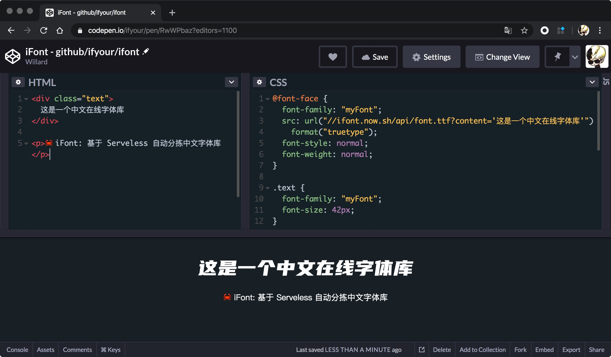

# iFont

> 基于 Serveless 自动分拣中文字体库

## Motivation

众所周知，网页上加载英文字体非常常见，英文字体就 20 来个字母外加符号。中文字体动辄几兆的体量，网页加载肯定是不现实，最多就是可以设置一些系统预装的字体。使用 iFont 从几兆的中文字体中挑选（分拣/Pick）出你要的字体加载，就很方便了，非常适合做一些个性化的主页。

相比图片优点：

- 动态生成
- 高清 Retina 无需而外处理
- 按需加载

## Usage

  🎉 <a href="https://codepen.io/ifyour/pen/RwWPbaz?editors=1100">Try it on Codepen.io!</a>

  

## Todo

- [ ] 官网
- [ ] 更多字体及用法

## License 许可

MIT
